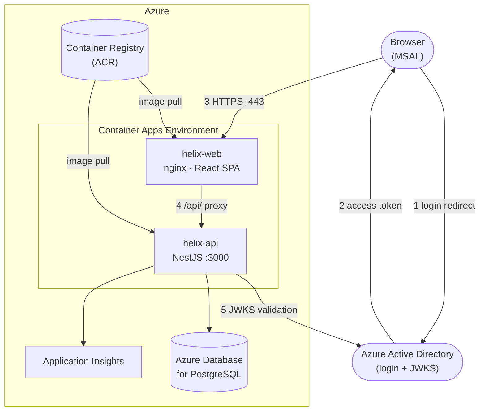

# Deploying Helix to Azure

This guide walks you through deploying the full Helix stack — React SPA, NestJS API, and PostgreSQL — on Azure using Container Apps and a managed database. It covers both Azure AD setup options (single vs. two app registrations) so you can choose what fits your organisation's policy.

---

## What You Are Deploying



**Key facts about how the pieces fit together:**

- The SPA is a static build served by nginx inside a Docker container. nginx also reverse-proxies `/api/` to the API container, so the browser only ever talks to one hostname.
- The API validates every request by verifying the Azure AD Bearer token using Microsoft's public JWKS endpoint — no client secret needed at runtime.
- `VITE_API_URL` is baked into the SPA image at build time (Docker `ARG`). You must set it before building the web image.

---

## Prerequisites

| Tool | Version | Why |
|------|---------|-----|
| Azure CLI | ≥ 2.57 | Deploy and configure all resources |
| Docker | ≥ 25 | Build and push images |
| pnpm | 11.1.3 | Build workspace packages (if building locally) |
| An Azure subscription | — | Owner or Contributor + AAD App Admin roles |

Log in and set your subscription:

```bash
az login
az account set --subscription "<your subscription name or ID>"
```

---

## Step 1 — Provision Azure Resources

Run these once. Adjust `LOCATION`, `RG`, and name prefixes to match your naming convention.

```bash
LOCATION="westeurope"
RG="rg-helix-prod"
ACR="helixprodacr"           # must be globally unique, lowercase, no hyphens
POSTGRES_SERVER="helix-prod-pg"
POSTGRES_DB="helix_prod"
POSTGRES_USER="helix"
POSTGRES_PASSWORD="<strong-random-password>"
APPINSIGHTS="helix-prod-ai"
CAE="helix-prod-env"         # Container Apps Environment

# Resource group
az group create --name $RG --location $LOCATION

# Container Registry
az acr create --resource-group $RG --name $ACR --sku Basic --admin-enabled true

# PostgreSQL Flexible Server (private access, no public IP)
az postgres flexible-server create \
  --resource-group $RG \
  --name $POSTGRES_SERVER \
  --location $LOCATION \
  --admin-user $POSTGRES_USER \
  --admin-password $POSTGRES_PASSWORD \
  --sku-name Standard_B1ms \
  --tier Burstable \
  --storage-size 32 \
  --database-name $POSTGRES_DB \
  --public-access None

# Application Insights
az monitor app-insights component create \
  --resource-group $RG \
  --app $APPINSIGHTS \
  --location $LOCATION \
  --kind web

# Container Apps Environment
az containerapp env create \
  --resource-group $RG \
  --name $CAE \
  --location $LOCATION
```

Capture the connection string for Application Insights — you will need it later:

```bash
AI_CONN_STR=$(az monitor app-insights component show \
  --resource-group $RG --app $APPINSIGHTS \
  --query connectionString -o tsv)
```

---

## Step 2 — Azure AD Setup

This is the most important configuration step. You have two options.

### When to use which option

| | Single registration | Two registrations |
|---|---|---|
| **Simplest** | ✅ | ❌ |
| **SPA and API in separate AAD tenants** | ❌ | ✅ |
| **Tightest permission scoping** | ❌ | ✅ |
| **Organisation policy requires distinct app identities** | ❌ | ✅ |

---

### Option A — Single App Registration

One Azure AD application represents both the SPA (MSAL interactive login) and the API (token audience). This is the recommended starting point.

#### Create the app registration

```
Azure Portal → Azure Active Directory → App registrations → New registration
```

| Field | Value |
|-------|-------|
| Name | `Helix` |
| Supported account types | Accounts in this organisational directory only |
| Redirect URI | **Single-page application (SPA)** → `https://<web-hostname>` |

After creation note down:
- **Application (client) ID** → `CLIENT_ID`
- **Directory (tenant) ID** → `TENANT_ID`

#### Expose an API scope

Navigate to **Expose an API**:

1. Set Application ID URI to `api://<CLIENT_ID>` (click *Save*).
2. Add a scope:
   - Scope name: `access_as_user`
   - Who can consent: **Admins and users**
   - Admin consent display name: `Access Helix as signed-in user`
   - State: **Enabled**

#### Grant the SPA permission to the scope

Navigate to **API permissions → Add a permission → My APIs → Helix**:

- Select `access_as_user`
- Click *Add permissions*
- Click **Grant admin consent for \<your tenant\>**

#### Environment variables — Option A

| Service | Variable | Value |
|---------|----------|-------|
| API | `AZURE_AD_TENANT_ID` | `<TENANT_ID>` |
| API | `AZURE_AD_CLIENT_ID` | `<CLIENT_ID>` |
| Web (build arg) | `VITE_AZURE_AD_TENANT_ID` | `<TENANT_ID>` |
| Web (build arg) | `VITE_AZURE_AD_CLIENT_ID` | `<CLIENT_ID>` |
| Web (build arg) | `VITE_AZURE_AD_API_CLIENT_ID` | *(leave empty — falls back to `VITE_AZURE_AD_CLIENT_ID`)* |

---

### Option B — Two App Registrations

Two separate Azure AD applications: one for the SPA identity, one as the API resource. Use this when your organisation requires distinct app identities, separate ownership, or multi-tenant API access.

```
┌──────────────────────────────┐        ┌──────────────────────────────┐
│  App reg: Helix Web          │        │  App reg: Helix API          │
│  (SPA — MSAL login)          │──────▶ │  (Resource — JWT audience)   │
│  CLIENT_ID_SPA               │ scope  │  CLIENT_ID_API               │
└──────────────────────────────┘        └──────────────────────────────┘
```

#### Create the API app registration

```
Azure AD → App registrations → New registration
```

| Field | Value |
|-------|-------|
| Name | `Helix API` |
| Supported account types | Accounts in this organisational directory only |
| Redirect URI | *(none)* |

Note down: **Application (client) ID** → `CLIENT_ID_API`

Navigate to **Expose an API**:
1. Set Application ID URI to `api://<CLIENT_ID_API>`.
2. Add scope `access_as_user` (same settings as Option A above).

#### Create the SPA app registration

```
Azure AD → App registrations → New registration
```

| Field | Value |
|-------|-------|
| Name | `Helix Web` |
| Supported account types | Accounts in this organisational directory only |
| Redirect URI | **Single-page application (SPA)** → `https://<web-hostname>` |

Note down: **Application (client) ID** → `CLIENT_ID_SPA` and **Directory (tenant) ID** → `TENANT_ID`

Navigate to **API permissions → Add a permission → My APIs → Helix API**:
- Select `access_as_user`
- Click **Grant admin consent**

#### Environment variables — Option B

| Service | Variable | Value |
|---------|----------|-------|
| API | `AZURE_AD_TENANT_ID` | `<TENANT_ID>` |
| API | `AZURE_AD_CLIENT_ID` | `<CLIENT_ID_API>` |
| Web (build arg) | `VITE_AZURE_AD_TENANT_ID` | `<TENANT_ID>` |
| Web (build arg) | `VITE_AZURE_AD_CLIENT_ID` | `<CLIENT_ID_SPA>` |
| Web (build arg) | `VITE_AZURE_AD_API_CLIENT_ID` | `<CLIENT_ID_API>` |

> `VITE_AZURE_AD_API_CLIENT_ID` tells `msal.ts` to request a token scoped to the API app. Without it the SPA would request a token for itself, which the API would reject.

---

## Step 3 — Build and Push Docker Images

Get the ACR login server and credentials:

```bash
ACR_SERVER=$(az acr show --name $ACR --query loginServer -o tsv)
ACR_PASSWORD=$(az acr credential show --name $ACR --query "passwords[0].value" -o tsv)

docker login $ACR_SERVER -u $ACR -p $ACR_PASSWORD
```

### Build the API image

```bash
cd helix/

docker build \
  -f apps/api/Dockerfile \
  -t $ACR_SERVER/helix-api:latest \
  .

docker push $ACR_SERVER/helix-api:latest
```

### Build the web image

The SPA bakes `VITE_API_URL` at build time. Use the public hostname of your web Container App (you can set it after the first deploy and rebuild, or set a custom domain upfront).

Replace the `VITE_*` values with those from **Step 2**.

```bash
# Option A example
docker build \
  -f apps/web/Dockerfile \
  --build-arg VITE_API_URL=https://<web-hostname>/api/v1 \
  --build-arg VITE_AZURE_AD_TENANT_ID=<TENANT_ID> \
  --build-arg VITE_AZURE_AD_CLIENT_ID=<CLIENT_ID> \
  -t $ACR_SERVER/helix-web:latest \
  .

# Option B example — add the API client ID arg
docker build \
  -f apps/web/Dockerfile \
  --build-arg VITE_API_URL=https://<web-hostname>/api/v1 \
  --build-arg VITE_AZURE_AD_TENANT_ID=<TENANT_ID> \
  --build-arg VITE_AZURE_AD_CLIENT_ID=<CLIENT_ID_SPA> \
  --build-arg VITE_AZURE_AD_API_CLIENT_ID=<CLIENT_ID_API> \
  -t $ACR_SERVER/helix-web:latest \
  .

docker push $ACR_SERVER/helix-web:latest
```

---

## Step 4 — Deploy the API Container App

Compose the `DATABASE_URL` from your Step 1 values:

```bash
DB_URL="postgresql://${POSTGRES_USER}:${POSTGRES_PASSWORD}@${POSTGRES_SERVER}.postgres.database.azure.com:5432/${POSTGRES_DB}?sslmode=require"
```

Deploy:

```bash
az containerapp create \
  --resource-group $RG \
  --environment $CAE \
  --name helix-api \
  --image $ACR_SERVER/helix-api:latest \
  --registry-server $ACR_SERVER \
  --registry-username $ACR \
  --registry-password $ACR_PASSWORD \
  --target-port 3000 \
  --ingress external \
  --min-replicas 1 \
  --max-replicas 3 \
  --cpu 0.5 --memory 1.0Gi \
  --env-vars \
    NODE_ENV=production \
    DATABASE_URL="$DB_URL" \
    AZURE_AD_TENANT_ID=<TENANT_ID> \
    AZURE_AD_CLIENT_ID=<CLIENT_ID_or_CLIENT_ID_API> \
    CORS_ORIGIN=https://<web-hostname> \
    APPLICATIONINSIGHTS_CONNECTION_STRING="$AI_CONN_STR"
```

Get the API's assigned hostname:

```bash
API_HOSTNAME=$(az containerapp show \
  --resource-group $RG --name helix-api \
  --query properties.configuration.ingress.fqdn -o tsv)
echo "API: https://$API_HOSTNAME"
```

---

## Step 5 — Deploy the Web Container App

```bash
az containerapp create \
  --resource-group $RG \
  --environment $CAE \
  --name helix-web \
  --image $ACR_SERVER/helix-web:latest \
  --registry-server $ACR_SERVER \
  --registry-username $ACR \
  --registry-password $ACR_PASSWORD \
  --target-port 80 \
  --ingress external \
  --min-replicas 1 \
  --max-replicas 2 \
  --cpu 0.25 --memory 0.5Gi
```

Get the web hostname:

```bash
WEB_HOSTNAME=$(az containerapp show \
  --resource-group $RG --name helix-web \
  --query properties.configuration.ingress.fqdn -o tsv)
echo "Web: https://$WEB_HOSTNAME"
```

> **nginx proxy note:** The nginx config in `apps/web/nginx.conf` forwards `/api/` to `http://api:3000/api/`. In Container Apps the hostname `api` resolves if both apps are in the same environment **and** you set the internal ingress on `helix-api`. For cross-container routing in Container Apps, set `helix-api` ingress to `internal` and update the nginx `proxy_pass` to point at the internal FQDN, or expose it externally and point nginx at the public API URL. The simplest production setup: keep `helix-api` **external** and set `VITE_API_URL` directly to `https://<api-hostname>/api/v1` — then the SPA calls the API directly and nginx proxying is not needed.

---

## Step 6 — Provision Users

Helix does not provision users automatically from Azure AD. An administrator must create user records in the database before a user can log in. At first login, the API binds the user's Azure AD OID to their record (email-based match).

Connect to the database and insert users:

```sql
INSERT INTO "User" (id, email, name, roles, "createdAt")
VALUES (
  gen_random_uuid(),
  'alice@yourcompany.com',
  'Alice Example',
  ARRAY['DemandRequester'],
  NOW()
);
```

Available roles: `DemandRequester`, `DemandApprover`, `PortfolioManager`, `SystemAdmin`.

---

## Step 7 — Verify

```bash
# Health check — should return 200
curl -s https://$API_HOSTNAME/api/v1/health || \
  curl -s https://$API_HOSTNAME/api/v1/auth/me   # returns 401 — API is up

# Open the SPA
open https://$WEB_HOSTNAME
```

On first visit:
1. MSAL redirects you to the Microsoft login page.
2. After login, the SPA calls `GET /auth/me` with the Bearer token.
3. If your account is provisioned, you land on the dashboard.
4. If not provisioned, the UI shows: *"Your account (you@company.com) is not provisioned in Helix. Contact your system administrator."*

---

## Updating the Application

```bash
# Rebuild and push (repeat Step 3)
docker build -f apps/api/Dockerfile -t $ACR_SERVER/helix-api:latest . && docker push $ACR_SERVER/helix-api:latest

# Update the running container (zero-downtime rolling update)
az containerapp update --resource-group $RG --name helix-api \
  --image $ACR_SERVER/helix-api:latest
```

Database migrations run automatically on API container startup (`prisma migrate deploy` is the container entrypoint).

---

## Environment Variable Reference

### API (`helix-api` Container App)

| Variable | Required | Description |
|----------|----------|-------------|
| `NODE_ENV` | Yes | Set to `production` |
| `DATABASE_URL` | Yes | PostgreSQL connection string with `?sslmode=require` |
| `AZURE_AD_TENANT_ID` | Yes | Azure AD tenant ID |
| `AZURE_AD_CLIENT_ID` | Yes | Client ID of the app registration that owns the API scope |
| `CORS_ORIGIN` | Yes | Full HTTPS URL of the web app (e.g. `https://helix-web.azurecontainerapps.io`) |
| `APPLICATIONINSIGHTS_CONNECTION_STRING` | Recommended | Application Insights connection string |

### Web image build args

| Build arg | Required | Description |
|-----------|----------|-------------|
| `VITE_API_URL` | Yes | Full base URL of the API including path prefix, e.g. `https://<api-host>/api/v1` |
| `VITE_AZURE_AD_TENANT_ID` | Yes | Azure AD tenant ID |
| `VITE_AZURE_AD_CLIENT_ID` | Yes | Client ID of the SPA app registration (Option A: same as API; Option B: SPA app) |
| `VITE_AZURE_AD_API_CLIENT_ID` | Option B only | Client ID of the API app registration — tells MSAL which audience to request a token for |

---

## Troubleshooting

### Browser shows "Account not provisioned"
The user authenticated successfully with Azure AD but has no record in the Helix database. Run the `INSERT` in Step 6 for their email address.

### API returns 401 on all requests
- Check that `AZURE_AD_TENANT_ID` and `AZURE_AD_CLIENT_ID` are set correctly on the API container.
- Confirm the MSAL scope in `msal.ts` resolves to `api://<CLIENT_ID_API>/access_as_user`. In Option A `CLIENT_ID_API` equals `VITE_AZURE_AD_CLIENT_ID`; in Option B it equals `VITE_AZURE_AD_API_CLIENT_ID`.
- Verify the scope was granted admin consent in Azure AD.

### CORS errors in the browser
`CORS_ORIGIN` on the API must exactly match the web app's origin, including the scheme (`https://`). No trailing slash.

### `prisma migrate deploy` fails on startup
The API container exits immediately and restarts. Check Container App logs:
```bash
az containerapp logs show --resource-group $RG --name helix-api --follow
```
Common causes: `DATABASE_URL` is wrong, the PostgreSQL firewall blocks Container Apps outbound IPs, or SSL mode is missing from the connection string.

### Redirect URI mismatch on Azure AD login
The redirect URI registered in Azure AD must exactly match `https://<web-hostname>`. Go to **App registration → Authentication** and verify the SPA redirect URI.
